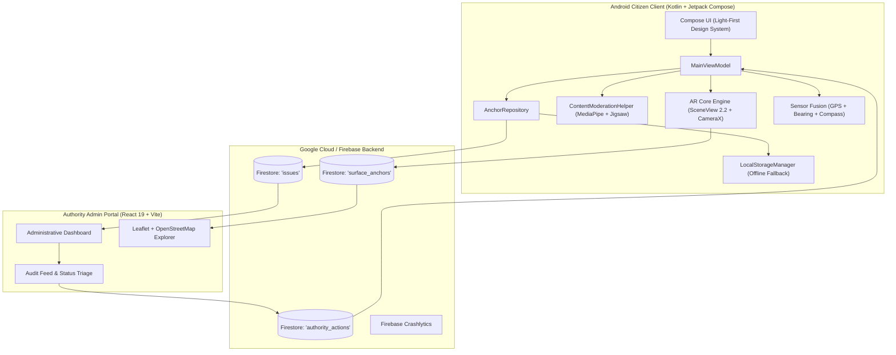

<div align="center">

# 🌐 Phantom Crowd

### Spatial Civic Reporting Infrastructure using Augmented Reality & On-Device AI

[](file:///d:/Hackathons/Aks/phantom-crowd/app/build.gradle)
[-success?style=for-the-badge&logo=testinglibrary)](file:///d:/Hackathons/Aks/phantom-crowd/app/src/test/java/com/phantomcrowd)
[-blue?style=for-the-badge&logo=android)](file:///d:/Hackathons/Aks/phantom-crowd/app/build.gradle)
[](https://developers.google.com/ar)
[](https://github.com/SceneView/sceneview-android)
[](file:///d:/Hackathons/Aks/phantom-crowd/app/src/main/java/com/phantomcrowd/ui/theme/DesignSystem.kt)
[](file:///d:/Hackathons/Aks/phantom-crowd/LICENSE)

<br/>

**Phantom Crowd** is an open-source spatial civic infrastructure platform that allows citizens to **anonymously report and visualize real-world issues anchored directly to physical locations** using Augmented Reality (AR) and on-device Machine Learning.

Instead of invisible tickets buried in centralized municipal portals, Phantom Crowd anchors civic reports directly to walls, sidewalks, and physical structures — forming a **shared, real-world spatial awareness layer** for safety, accessibility, environmental hazards, and municipal transparency.

[Key Features](#-key-features) • [System Architecture](#-system-architecture) • [Civic Categories](#-supported-civic-categories) • [Getting Started](#-getting-started) • [Verification](#-verification--tests) • [Privacy Model](#-privacy--security-model)

</div>

---

## 📌 The Problem & The Solution

| Traditional Civic Reporting | Phantom Crowd Spatial Reporting |
|---|---|
| ❌ **Centralized & Hidden**: Reports sit in siloed back-office databases invisible to the public. | ✅ **Public & Spatial**: Reports float in 3D AR right where the problem exists in the physical world. |
| ❌ **Identity Verification Required**: Users hesitate to report safety threats or harassment for fear of retaliation. | ✅ **Anonymous by Design**: Zero accounts, zero phone/email collection, zero device fingerprinting. |
| ❌ **Lacks Spatial Context**: Vague descriptions ("light pole near gate") lead to delayed maintenance. | ✅ **Sub-Meter Accuracy**: Anchored to physical planes via ARCore and geospatial coordinates. |
| ❌ **Slow Community Validation**: No transparency into whether others have encountered the issue. | ✅ **Crowd Validation**: Nearby citizens confirm issues in real-time with one-tap verifications. |

---

## 🚀 Key Features

### 1. 🧱 3D Surface AR Placement (ARCore & SceneView)
* Scans physical horizontal and vertical planes (walls, pathways, infrastructure).
* Anchors virtual notices to surfaces using sub-meter relative spatial offsets and surface normal vectors ($N_x, N_y, N_z$), allowing markers to persist across different user sessions without expensive proprietary cloud services.
* Defensive camera arbitration: Automatically unbinds CameraX before starting ARCore sessions to prevent hardware lockups.

### 2. 🧭 Turn-by-Turn AR Walking Navigation
* **3D Direction Arrow HUD**: Dynamic directional overlay pointing directly toward target coordinates using real-time sensor fusion and bearing calculations.
* **Radar Minimap**: Real-time Cartesian-projected top-down minimap overlay.
* **Text-to-Speech (TTS) Voice Guidance**: Audio milestone alerts (at 200m, 100m, 50m, 20m) and arrival notifications powered by Android's speech synthesis engine.

### 3. 🛡️ On-Device AI Content Moderation (Zero PII Leakage)
* Performs content moderation **strictly on-device** before text is uploaded to Firestore.
* **Tier 1 Heuristic Engine**: Real-time regex and token scoring based on the Jigsaw Toxic Comment Dataset (threats, severe toxicity, hate speech, harassment).
* **Tier 2 ML Classifier**: High-speed on-device NLP inference via Google MediaPipe Text Tasks (`average_word_classifier.tflite`) executing in 0–1ms via the XNNPACK delegate.

### 4. 🗺️ OpenStreetMap & Spatial Risk Heatmaps
* Free, open-source geospatial visualization powered by `osmdroid` (zero Google Maps billing or API key friction).
* Real-time density polygon heatmaps highlighting risk zones (Red $\ge 5$, Yellow 2–4, Green 1).
* Geohash-based spatial bounding queries for low latency and minimal network overhead.

### 5. 🔔 Proximity Background Geofencing
* Google Play Services Location geofencing registers 100m circular perimeters around nearby issues.
* Background transition alerts (Enter & Dwell) dispatch proactive warnings (`POST_NOTIFICATIONS`) to keep citizens alert in hazardous zones.

### 6. 📊 Real-Time Impact Dashboard
* Live Firestore synchronization tracking total reports, verified fixes, issues in-progress, and estimated community reach.
* Direct linkage with the companion **React 19 / TypeScript Authority Admin Portal** (`authority_actions`), surfacing verified administrative resolutions.

---

## 🏛️ System Architecture



---

## 🏷️ Supported Civic Categories

Phantom Crowd classifies issues across six core humanitarian and civic categories:

| Category | Icon | Subcategories Covered |
|---|:---:|---|
| **Women's Safety** | 👩 | Assault, Harassment Zones, Poor Lighting / Stalking, No Emergency Help |
| **Accessibility** | ♿ | Broken Wheelchair Ramps, Inaccessible Entrances, Missing Elevators, Blocked Paths |
| **Facilities** | 🏢 | Water Leaks, Exposed Electrical Wiring, Broken Equipment, Structural Damage |
| **Environmental** | 🌍 | Overflowing Trash, Chemical Spills, Drainage Overflow, Bad Odor, Noise Pollution |
| **Labor Rights** | 👷 | Safety Violations, Hazardous Working Conditions, Wage Abuse |
| **Civil Resistance** | 🎙️ | Rights Violations, Censorship, Police Excesses, Public Intimidation |

Each issue incorporates an emergency severity scale: **URGENT** (Pulse indicator), **HIGH**, **MEDIUM**, and **LOW**.

---

## 🛠️ Technology Stack

```
Android Client
├── Language:           Kotlin 1.9.20
├── UI Framework:       Jetpack Compose (BOM 2023.08.00) + Material 3
├── Architecture:       MVVM + Repository Pattern + StateFlow / Coroutines
├── AR & 3D:            ARCore 1.41.0 + SceneView 2.2.1 (Filament Engine)
├── Camera Feed:        AndroidX CameraX 1.3.1 (Camera2 Lifecycle)
├── Mapping:            osmdroid (OpenStreetMap) 6.1.20
├── On-Device AI:       Google MediaPipe Text Tasks + TFLite
├── Backend:            Firebase Firestore (BOM 32.7.0) + Crashlytics
└── Testing:            JUnit 4, Mockito Kotlin 5.2.1, Turbine 1.0.0

Authority Portal (Companion Sibling App)
├── Framework:          React 19 + TypeScript + Vite 7
├── Mapping:            Leaflet 1.9 + react-leaflet-cluster + OpenStreetMap
└── Authentication:     Google OAuth with Firestore admin allowlist
```

---

## 📂 Project Structure

```
phantom-crowd/
├── app/
│   ├── build.gradle                  # App build configuration (SDK 35, JVM 17/21)
│   ├── google-services.json          # Firebase client configuration
│   ├── proguard-rules.pro            # R8 Proguard rules
│   └── src/
│       ├── main/
│       │   ├── AndroidManifest.xml   # Camera, Location, Geofence, AR declarations
│       │   ├── assets/
│       │   │   └── average_word_classifier.tflite # On-device MediaPipe NLP model
│       │   └── java/com/phantomcrowd/
│       │       ├── ai/               # ContentModerationHelper (MediaPipe + Jigsaw)
│       │       ├── ar/               # ARCoreManager, SceneView, VoiceGuidanceManager
│       │       ├── data/             # AnchorData, Repository, Firebase & Surface Managers
│       │       ├── receiver/         # GeofenceReceiver (Background transitions)
│       │       ├── ui/               # Jetpack Compose Screens, ViewModel, DesignSystem
│       │       │   ├── components/   # PCard, PChip, SeverityBadge, Minimap, 3D Arrow
│       │       │   ├── tabs/         # MapDiscoveryTab, NavigationTab
│       │       │   └── theme/        # Light-First tokens, Typography, Color palette
│       │       └── utils/            # GeohashingUtility, GPSUtils, BearingCalculator
│       └── test/                     # Unit test suites (AnchorRepositoryTest, AnchorDataTest)
├── docs/                             # Architecture diagrams, restoration audits, setup guides
├── gradle/wrapper/                   # Gradle 8.13 distribution
├── build.gradle                      # Top-level Gradle script (AGP 8.13.2)
├── settings.gradle                   # Gradle settings (':app')
└── local.properties                  # Local SDK path and AR_CORE_API_KEY (git-ignored)
```

---

## ⚡ Getting Started

### Prerequisites
* **Android Studio**: Ladybug / Hedgehog (2023.1.1+) or newer.
* **JDK**: **Java 17 or Java 21** (JDK 21 from Android Studio's bundled JBR is strongly recommended; avoid system Java 25 as it conflicts with AGP reflection).
* **Android SDK**: API Level 35 (`platforms/android-35`).
* **Hardware**: Physical Android device running Android 8.0+ (API 24+) with **Google Play Services for AR (ARCore)** installed. *(Camera and AR plane detection are not supported in standard emulators)*.

### Step 1: Clone Repository
```bash
git clone https://github.com/akshaya12406-byte/phantom-crowd.git
cd phantom-crowd
```

### Step 2: Configure Environment Keys
Create or update `local.properties` in the project root:
```properties
sdk.dir=C\:\\Users\\<YourUsername>\\AppData\\Local\\Android\\Sdk

# Optional: ARCore Geospatial VPS API Key
AR_CORE_API_KEY=YOUR_ARCORE_API_KEY_HERE
```
*(Basic AR surface plane detection functions completely without an API key).*

### Step 3: Firebase Configuration
1. Ensure your `google-services.json` file is present in the `app/` directory.
2. Enable **Cloud Firestore** in your Firebase Console for project `phantom-crowd`.

---

## 🧪 Verification & Tests

### Execute Unit Tests
Verify the repository fallback logic, geohash calculation, and data models:
```bash
# Set JAVA_HOME to Android Studio JBR if system default is Java 25+
$env:JAVA_HOME = "C:\Program Files\Android\Android Studio\jbr"

.\gradlew.bat testDebugUnitTest
```
**Test Results:** `11/11 tests passed (100% success rate) in ~1.2s`.

### Build Debug APK
Assemble the complete debug binary:
```bash
.\gradlew.bat assembleDebug
```
The compiled output is generated at:
`app/build/outputs/apk/debug/app-debug.apk`

---

## 🔒 Privacy & Security Model

Phantom Crowd is architected from the ground up for strict privacy preservation:
* **Zero PII Storage**: Reports contain only GPS coordinates, a category tag, a severity indicator, and description text. No usernames, emails, IP addresses, or device IDs are recorded.
* **On-Device Moderation**: Toxicity checks occur on the local device via MediaPipe. Abusive or violating submissions are rejected before reaching cloud infrastructure.
* **Credential Isolation**: Secrets like `AR_CORE_API_KEY` are injected at build time from `local.properties` via Gradle manifest placeholders and are excluded from git.
* **16 KB Alignment Safe**: Pre-configured with legacy native library packaging (`useLegacyPackaging = true`) to ensure seamless execution on modern 16 KB memory-aligned Android devices (Android 15+).

---

## 🤝 Contributing

We welcome contributions! Please review our guidelines before submitting a pull request:
1. Fork the repository and create your feature branch: `git checkout -b feature/amazing-feature`
2. Follow Kotlin official style guidelines and Jetpack Compose component patterns.
3. Verify your changes pass all unit tests: `./gradlew testDebugUnitTest`
4. Commit your changes: `git commit -m "Add amazing spatial feature"`
5. Push to your branch and submit a Pull Request.

Please see [CONTRIBUTING.md](file:///d:/Hackathons/Aks/phantom-crowd/CONTRIBUTING.md) and [CODE_OF_CONDUCT.md](file:///d:/Hackathons/Aks/phantom-crowd/CODE_OF_CONDUCT.md) for details.

---

## 📄 License

This project is licensed under the **MIT License** — see the [LICENSE](file:///d:/Hackathons/Aks/phantom-crowd/LICENSE) file for details.
